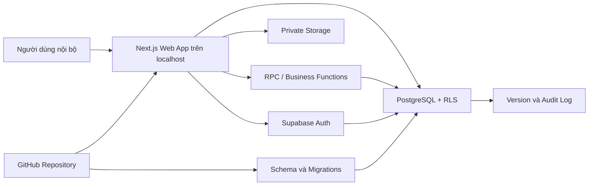
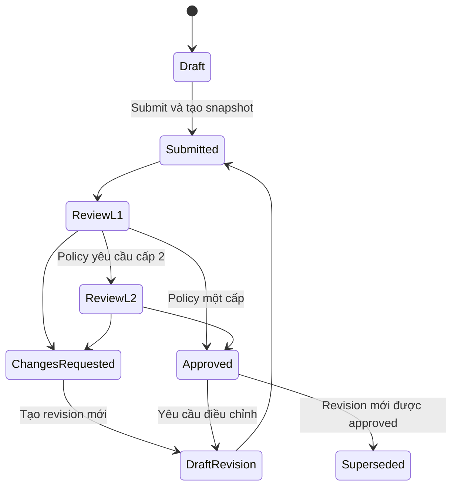

# Đặc tả thiết kế — Sagen PO Forecasting Web App

**Ngày:** 2026-08-11
**Trạng thái:** Đã được người dùng duyệt ngày 2026-08-11
**Phạm vi:** MVP chạy trên localhost, sử dụng Supabase development project làm backend
**Nguồn nghiệp vụ:** `ETX_PO_Forecasting_2026_28_Jul_5M.xlsx`, trọng tâm sheet `Forecast 5M`
**GitHub repository:** `https://github.com/megamatvn/PO_Forecasting.git`

> Tài liệu này không chứa database password, connection string đầy đủ, Supabase service key hoặc bất kỳ secret nào.

## 1. Tóm tắt quyết định

Xây dựng một web app nội bộ nhiều người dùng để thay thế sheet `Forecast 5M` và trở thành nguồn lập kế hoạch PO chính thức. Excel chỉ còn là nguồn nhập dữ liệu định kỳ và định dạng xuất báo cáo.

Kiến trúc được chọn là **product-first modular monolith**:

- Next.js App Router + TypeScript cho ứng dụng web.
- Supabase Auth, PostgreSQL, RLS và private Storage cho backend.
- Giao diện Forecast Planning được thiết kế riêng, không mô phỏng Excel theo kiểu sao chép nguyên trạng.
- Số đợt PO linh hoạt, không hard-code PO #1 đến PO #6.
- Tính toán quan trọng và chuyển trạng thái nghiệp vụ được xác nhận ở backend.
- GitHub quản lý code, migrations, tests và tài liệu; secrets chỉ nằm trong cấu hình local hoặc secret store.

## 2. Mục tiêu

1. Giúp Planner nhận ra ngân sách, SKU thiếu hàng và việc cần làm trong vài giây đầu.
2. Loại bỏ lỗi công thức, lỗi tham chiếu và ghi đè dữ liệu thường gặp trong Excel.
3. Cho phép nhiều người lập, xem và duyệt kế hoạch theo đúng nhãn hàng được phân quyền.
4. Cung cấp approval, version, revision và audit đầy đủ.
5. Bảo đảm mọi số liệu PO truy ngược được về dữ liệu nguồn, công thức và người thực hiện.
6. Giữ quy trình import/export Excel trong giai đoạn chuyển đổi.

## 3. Ngoài phạm vi MVP

- Triển khai production và tên miền chính thức.
- Đồng bộ ERP/API theo thời gian thực.
- Email, Teams hoặc Slack notification.
- AI tự động dự báo nhu cầu hoặc tối ưu lịch PO.
- Ứng dụng mobile native.
- Phân tích PA, công nợ và dòng tiền nâng cao ngoài phạm vi thay thế `Forecast 5M`.

MVP vẫn cung cấp tổng giá trị PO, khoảng trống ngân sách và báo cáo cơ bản phục vụ quyết định mua hàng.

## 4. Kết quả khảo sát workbook

Workbook có 22 sheet; vùng nghiệp vụ chính được đọc từ `Forecast 5M!C2:AK19`, gồm 13 SKU. Luồng dữ liệu chính:

```text
Purchased history
  → Sales forecast
  → Current inventory
  → Planned PO waves (Qty / FOC / Amount)
  → Projected closing inventory
  → Months of cover và cash planning downstream
```

Các số tổng hợp quan trọng trong workbook:

| Chỉ số | Giá trị |
|---|---:|
| Mục tiêu mua năm 2026 | €5.002.216,46 |
| Đã mua / cam kết | €2.252.114,46 |
| Khoảng trống | €2.750.102,00 |

Các ngoại lệ đã được xác nhận:

1. **ET-015150 vẫn active.** Tồn hiện tại 32, forecast còn lại 2.400 và không có PO tương lai, dẫn đến tồn dự kiến `-2.368`. Hệ thống phải cảnh báo Critical và đề xuất bổ sung tối thiểu 2.368 sản phẩm.
2. **Amount luôn bằng Qty × Ex Price.** Một số công thức Amount trong PO #6 của workbook tham chiếu sai cột, có khả năng làm thấp tổng giá trị €88.912. Web app không cho nhập Amount thủ công.
3. **Đặc trị xanh có ba SKU:** ET-015025, ET-015026 và ET-015027. Tất cả tự động quy về canonical SKU ET-015025.

## 5. Kiến trúc tổng thể



### 5.1 Ranh giới module

| Module | Trách nhiệm |
|---|---|
| Authentication & Workspace | Đăng nhập, session, vai trò và phạm vi nhãn hàng |
| Master Data | Nhãn hàng, sản phẩm, canonical SKU, SKU alias, nhà cung cấp, giá |
| Data Import | Upload, staging, chuẩn hóa, validation, diff và commit import |
| Forecast Planning | Forecast, inventory, PO plan, cảnh báo và mô phỏng tồn |
| Approval Engine | Chính sách duyệt, snapshot, các bước duyệt và ngoại lệ |
| Version & Audit | Revision, comparison, immutable history và audit event |
| Dashboard & Reports | KPI, lịch PO, ngân sách và export Excel |
| Administration | Người dùng, quyền, nhãn hàng và cấu hình hệ thống |

### 5.2 Nguyên tắc phân lớp

- UI phụ trách tương tác, hiển thị và optimistic feedback.
- Domain services phụ trách validation và quy tắc nghiệp vụ có thể kiểm thử độc lập.
- Các thao tác quan trọng như import commit, submit, approve, reject và create revision chạy trong transaction.
- Database constraints bảo vệ invariant ngay cả khi dữ liệu không đi qua UI.
- RLS là hàng rào dữ liệu cuối cùng; ẩn nút trên UI không được xem là cơ chế bảo mật.

## 6. Mô hình dữ liệu

### 6.1 Identity và phân quyền

| Entity | Mục đích |
|---|---|
| `profiles` | Hồ sơ gắn với Supabase Auth user |
| `roles` | Administrator, Planner/Buyer, Approver L1, Approver L2, Viewer/Auditor |
| `user_roles` | Một người có thể giữ nhiều vai trò |
| `user_brand_access` | Giới hạn quyền theo một hoặc nhiều nhãn hàng |

### 6.2 Master data

| Entity | Mục đích |
|---|---|
| `brands` | Danh mục nhãn hàng |
| `products` | Sản phẩm chuẩn và canonical SKU |
| `sku_aliases` | Mã nguồn hoặc mã cũ ánh xạ về canonical SKU |
| `suppliers` | Nhà cung cấp |
| `product_prices` | Lịch sử Ex Price theo thời điểm và đồng tiền |
| `planning_settings` | Lead time, safety stock, target cover và quy tắc khuyến nghị |

`sku_aliases.alias_sku` là duy nhất. Không cho một alias ánh xạ đến nhiều sản phẩm chuẩn trong cùng thời kỳ hiệu lực.

### 6.3 Dữ liệu nguồn và import

| Entity | Mục đích |
|---|---|
| `import_batches` | File, checksum, trạng thái, người import và thời gian |
| `import_staging_rows` | Dữ liệu chưa commit, mã gốc và kết quả validation |
| `import_issues` | Error hoặc Warning theo dòng và trường |
| `source_snapshots` | Snapshot dữ liệu nguồn sau mỗi batch được xác nhận |
| `sales_demand` | Nhu cầu hoặc forecast theo SKU và tháng |
| `inventory_snapshots` | Tồn kho theo SKU và ngày chốt |
| `purchased_receipts` | Mua hàng, hàng về và dữ liệu lịch sử |

### 6.4 Kế hoạch và PO

| Entity | Mục đích |
|---|---|
| `planning_cycles` | Chu kỳ lập kế hoạch theo năm hoặc kỳ |
| `plan_versions` | Draft, snapshot gửi duyệt và bản approved |
| `plan_lines` | Một dòng canonical product trong một version |
| `plan_monthly_demand` | Forecast theo tháng được chụp cùng version |
| `purchase_batches` | Đợt PO linh hoạt với ngày đặt, ETA và trạng thái |
| `purchase_lines` | Qty, FOC Qty, Ex Price và Amount theo SKU |

Không có cột cố định PO #1 đến PO #6. `purchase_batches` cho phép tạo số đợt bất kỳ.

### 6.5 Approval, version và audit

| Entity | Mục đích |
|---|---|
| `approval_policies` | Fixed two-level hoặc threshold-based |
| `approval_policy_brands` | Gán một chính sách cho một hoặc nhiều nhãn hàng |
| `approval_requests` | Hồ sơ gửi duyệt và policy snapshot |
| `approval_steps` | Cấp duyệt, người xử lý, quyết định và lý do |
| `version_diffs` | Chênh lệch giữa các revision |
| `audit_events` | Nhật ký append-only |

Mỗi nhãn hàng chỉ có một policy hiệu lực tại một thời điểm. Nếu không có policy riêng, hệ thống dùng policy mặc định toàn hệ thống là fixed two-level.

## 7. Công thức nghiệp vụ

```text
Amount = Qty × Ex Price
Receipt Qty = Qty + FOC Qty

Closing Stock tháng M
  = Closing Stock tháng M-1
  + Receipt Qty có ETA trong tháng M
  - Forecast Sales tháng M

Shortage = max(0, Target Stock - Projected Stock)
```

Quy tắc:

- `Amount` được sinh tự động bằng kiểu `numeric/decimal`; người dùng không được nhập trực tiếp.
- FOC làm tăng tồn kho nhưng không làm tăng Amount.
- PO canceled không được tính vào receipt.
- PO chỉ được đưa vào tháng nhận hàng theo ETA hiệu lực.
- `Target Stock` mặc định là 0 nếu chưa cấu hình safety stock hoặc target cover.
- Nếu có safety stock hoặc target cover, recommended Qty bao gồm cả phần bù dự trữ.
- Nếu Ex Price chưa có, hệ thống vẫn tính được shortage theo số lượng nhưng chặn Submit PO có Amount chưa xác định.

Ca chuẩn ET-015150:

```text
Current stock     = 32
Remaining demand  = 2.400
Future receipts   = 0
Projected stock   = 32 - 2.400 = -2.368
Minimum proposal  = 2.368
```

## 8. Approval Policy Engine

### 8.1 Hai chế độ

1. **Fixed two-level:** mọi hồ sơ qua Approver L1 rồi Approver L2.
2. **Threshold-based:** dưới hạn mức chỉ cần L1; từ hạn mức trở lên cần L1 và L2.

### 8.2 Phạm vi cấu hình

- Administrator tạo, sửa, kích hoạt hoặc vô hiệu hóa policy.
- Một policy có thể gán hàng loạt cho một hoặc nhiều nhãn hàng.
- Policy mặc định của hệ thống luôn là fixed two-level.
- Khi policy riêng hết hiệu lực hoặc bị vô hiệu hóa, nhãn hàng quay về policy mặc định.
- Thay đổi policy không tác động hồi tố đến hồ sơ đang duyệt.

### 8.3 Ngoại lệ nâng cấp duyệt

Dù policy theo hạn mức cho phép một cấp, các trường hợp sau luôn nâng lên hai cấp:

- Vượt ngân sách được phê duyệt.
- Override Ex Price hoặc dùng giá ngoài khoảng hiệu lực.
- Điều chỉnh kế hoạch hoặc PO đã duyệt.
- Các ngoại lệ nghiệp vụ khác được Administrator bật trong policy.

### 8.4 Snapshot policy

Tại thời điểm Submit, hệ thống chụp:

- Policy và version policy.
- Hạn mức, tiền tệ và Amount dùng để định tuyến.
- Vai trò hoặc người duyệt từng cấp.
- Các exception flags đã kích hoạt.

Snapshot này không đổi trong suốt vòng duyệt hiện tại.

## 9. Version và trạng thái



Quy tắc bất biến:

- Version đã Submit không sửa trực tiếp.
- Request changes tạo Draft revision mới; snapshot cũ giữ nguyên để audit.
- Approved version bất biến.
- Khi revision mới được approved, approved version trước chuyển thành Superseded nhưng không bị xóa.
- Mọi revision có liên kết `parent_version_id` và version number tăng tuần tự.

## 10. Quy trình import Excel

### 10.1 Lần khởi tạo

Lần đầu có thể import đầy đủ dữ liệu nguồn và kế hoạch hiện tại để tạo baseline.

### 10.2 Import định kỳ

Mặc định chỉ cập nhật:

- Sales hoặc forecast nguồn.
- Inventory.
- Purchased và hàng đang về.
- Product master, SKU alias và bảng giá.

Không ghi đè version Submitted, Approved hoặc Superseded.

Administrator có thể chủ động áp dụng dữ liệu kế hoạch vào Draft sau khi xem diff và xác nhận rõ phạm vi thay đổi.

### 10.3 Import hai pha

```text
Upload
  → Staging
  → Canonicalize SKU
  → Validate
  → Preview diff
  → Administrator confirms
  → Atomic commit
  → Source snapshot
  → Recalculate affected Drafts
```

- Error chặn toàn bộ batch.
- Warning được phép xác nhận.
- Checksum ngăn nhập trùng file ngoài ý muốn.
- File gốc, mã SKU gốc và mapping result được giữ để audit.
- Commit thành công hoặc rollback toàn bộ; không tồn tại trạng thái nhập dở dang.

## 11. UI/UX

### 11.1 Nguyên tắc

- Desktop-first, dùng tốt từ 1366×768 trở lên.
- Người dùng thấy mục tiêu mua, đã cam kết, khoảng trống và SKU Critical trong vùng nhìn đầu tiên.
- Dùng màu đỏ cho Critical, hổ phách cho Warning và xanh cho trạng thái an toàn.
- Không dùng màu là tín hiệu duy nhất; luôn có nhãn và mô tả.
- SKU và tên sản phẩm được ghim khi cuộn ngang.
- Các trường nhập được phân biệt rõ với trường tính tự động.

### 11.2 Forecast Planning Workspace

Màn hình chính gồm:

1. Header với nhãn hàng, chu kỳ, version và trạng thái.
2. KPI cards: target purchase, committed amount, budget gap, Critical SKU và số đợt PO.
3. Alert ưu tiên, ví dụ ET-015150 thiếu 2.368.
4. Planning grid cho Current Stock, Remaining Forecast, PO, Qty, FOC, Ex Price, Amount và Projected Stock.
5. Insight rail giải thích nguyên nhân và đề xuất hành động.
6. Tabs cho Planning Grid, PO Timeline, Cash Summary và Version History.
7. Nút Submit hiển thị rõ policy áp dụng và số cấp duyệt trước khi xác nhận.

### 11.3 Tương tác chính

- Autosave Draft có trạng thái Saved/Saving/Error rõ ràng.
- Bulk edit cho nhiều SKU nhưng phải preview trước khi áp dụng.
- Người dùng có thể tạo PO đề xuất trực tiếp từ cảnh báo shortage.
- Diff viewer hiển thị Before, After và Impact theo Qty, Amount, ETA và tồn kho.
- Approval view tập trung vào ngoại lệ, chênh lệch và tác động ngân sách thay vì bắt người duyệt đọc toàn bộ grid.

## 12. Phân quyền

| Vai trò | Quyền chính |
|---|---|
| Administrator | Quản trị người dùng, nhãn hàng, import, policy và cấu hình |
| Planner/Buyer | Tạo Draft, sửa kế hoạch, tạo PO đề xuất và Submit |
| Approver L1 | Review nghiệp vụ, approve cấp 1 hoặc request changes |
| Approver L2 | Phê duyệt cuối hoặc request changes |
| Viewer/Auditor | Xem, export và tra cứu lịch sử |

Một người có thể giữ nhiều vai trò. Mọi quyền tiếp tục bị giới hạn bởi `user_brand_access`.

## 13. Bảo mật và secrets

- Database connection strings, passwords và service-role key chỉ tồn tại ở local secret configuration hoặc secret store.
- `.env.local` phải nằm trong `.gitignore`; `.env.example` chỉ chứa tên biến và placeholder.
- Browser không bao giờ nhận database password hoặc service-role key.
- Transaction pooler dành cho runtime server tasks; direct connection dành cho migration/CLI phù hợp; session pooler chỉ dùng khi cần session cố định.
- Tất cả bảng exposed bật RLS và mặc định deny.
- Không cấp quyền dữ liệu nghiệp vụ cho unauthenticated users.
- Authorization dựa trên bảng quyền hoặc app metadata đáng tin cậy, không dựa vào user-editable metadata.
- Private Storage bucket dùng cho file Excel; quyền tải file đi qua policy.
- Audit log append-only đối với người dùng ứng dụng.
- Trước production phải rotate mật khẩu đã từng chia sẻ trong hội thoại hoặc kênh không phải secret manager.

## 14. Đồng thời và xử lý lỗi

### 14.1 Optimistic concurrency

- Mỗi Draft có `lock_version`.
- Update phải gửi version đã đọc.
- Nếu version không khớp, backend trả conflict thay vì last-write-wins.
- UI hiển thị diff và cho phép reload hoặc áp dụng lại thay đổi hợp lệ.
- Presence có thể hiển thị ai đang mở cùng kế hoạch nhưng không thay thế kiểm tra `lock_version`.

### 14.2 Idempotency

Các action Submit, Approve, Reject, Create Revision và Import Commit nhận idempotency key. Retry do mất mạng không được tạo hai approval step, hai revision hoặc hai import batch đã commit.

### 14.3 Thông báo lỗi

- Thông báo dùng ngôn ngữ nghiệp vụ và chỉ rõ cách xử lý.
- Ví dụ: `Không thể gửi duyệt vì ET-015150 chưa có Ex Price`.
- Backend errors có correlation ID để tra cứu.
- Không đưa stack trace, SQL, secret hoặc thông tin hạ tầng vào thông báo cho người dùng.

## 15. Chiến lược kiểm thử

### 15.1 Unit tests

- Amount, Receipt Qty, Projected Stock và Shortage.
- Canonical SKU mapping.
- Approval routing theo fixed/threshold/exception.
- Version state machine và invariant bất biến.

### 15.2 Database integration tests

- Ma trận RLS theo role × brand × action.
- Constraints, generated/calculated values và transaction rollback.
- Import commit, checksum và idempotency.
- Submit/approve/reject/create revision chạy nguyên tử.
- Audit event được tạo đúng và không sửa được qua application role.

### 15.3 Component tests

- Planning grid input và calculated cells.
- Autosave states.
- Validation message.
- Conflict dialog và diff viewer.
- Approval policy preview trước Submit.

### 15.4 End-to-end tests

```text
Login
  → Import
  → Preview diff
  → Commit source data
  → Create/Edit Draft
  → Submit
  → L1 review
  → L2 review hoặc one-level branch
  → Approved
  → Create revision
  → Compare versions
  → Export
```

Workbook thật không commit vào Git. Test tự động dùng synthetic fixtures; local regression có thể dùng workbook thật nằm ngoài Git.

## 16. Tiêu chí nghiệm thu bắt buộc

1. ET-015150 hiển thị shortage 2.368 khi không có PO tương lai.
2. Amount luôn bằng Qty × Ex Price.
3. ET-015025, ET-015026 và ET-015027 chỉ tạo một canonical product ET-015025.
4. Import định kỳ không ghi đè version đã Submit hoặc Approved.
5. Nhãn hàng không có policy riêng áp dụng fixed two-level.
6. Policy threshold rẽ đúng một hoặc hai cấp.
7. Exception escalation buộc duyệt hai cấp.
8. Approved version không thể chỉnh sửa trực tiếp.
9. Người dùng không truy cập được nhãn hàng ngoài phạm vi.
10. Hai người sửa cùng Draft không ghi đè âm thầm.
11. Retry không tạo action trùng.
12. Không có database password hoặc service key trong Git history hay browser bundle.
13. Build, lint, type-check và các E2E trọng yếu đều pass.
14. Không còn lỗi bảo mật Critical/High về access control hoặc secrets trước khi nghiệm thu MVP.

## 17. Phạm vi MVP đã khóa

- Authentication và RBAC theo nhãn hàng.
- Master data và SKU aliases.
- Excel import staging/diff/commit.
- Forecast Planning Workspace.
- Dynamic PO batches và PO lines.
- Calculation, alerts và recommended Qty.
- Configurable Approval Policy Engine.
- Version, revision, diff và audit.
- Dashboard, timeline, summary và Excel export.
- Optimistic concurrency và autosave.
- Supabase migrations, tests và tài liệu trong GitHub repository.

## 18. Điều kiện chuyển sang implementation plan

1. Người dùng review và duyệt tài liệu này.
2. Xác định GitHub repository hoặc cho phép tạo repository mới, bao gồm tên và visibility.
3. Cung cấp Supabase publishable/anon key khi bắt đầu kết nối frontend; không đưa key nhạy cảm vào Git.
4. Lập implementation plan theo vertical slices, mỗi slice có migration, domain tests, UI và E2E tương ứng.

## 19. Nhật ký quyết định

| Quyết định | Kết quả |
|---|---|
| ET-015150 | Active; cảnh báo và đề xuất bổ sung tối thiểu 2.368 |
| Amount | Bắt buộc Qty × Ex Price |
| Đặc trị xanh | ET-015025 là canonical SKU cho 015025/26/27 |
| Nguồn kế hoạch chính | Web app |
| Excel | Import định kỳ và export; không ghi đè approved plan |
| Approval mặc định | Fixed two-level |
| Approval tùy chỉnh | Fixed hoặc threshold, gán cho một hay nhiều nhãn hàng |
| Version | Submitted/Approved bất biến; chỉnh sửa qua revision |
| Vai trò | Admin, Planner, L1, L2, Viewer/Auditor |
| Kiến trúc | Next.js modular monolith + Supabase |
| Môi trường hiện tại | Frontend localhost + Supabase development backend |
| Source control | GitHub; secrets không được commit |
